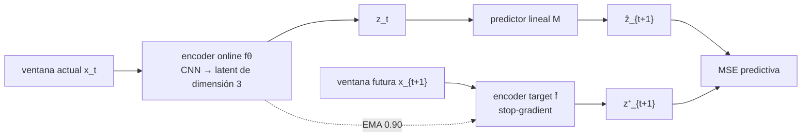

# Koopman-JEPA

¿Puede un JEPA aprender una representación `z_t = fθ(x_t)` en la que la dinámica
sea lineal y no trivial?

El experimento estudia esta pregunta en un sistema sintético controlado de
cuatro fases. La condición central es

$$
M z_t \approx z_{t+1},
\qquad
M A \approx A K,
$$

donde `K` es el operador verdadero sobre la fase, `A` cambia de la base de fase
a la base aprendida y `M` es el predictor lineal del JEPA.

> **Resultado:** bajo los datos y la receta documentados, el predictor identifica
> correctamente tres operadores distintos en 10/10 seeds por condición, incluido
> el ciclo con espectro activo $\{-1,i,-i\}$. En una familia continua también
> sigue la intensidad dinámica con MAE espectral 0.027 y $R^2=0.9998$.
>
> **Límite importante:** esto no demuestra que JEPA sea necesario ni superior.
> En una comparación exploratoria de una seed, DMD crudo y PCA+DMD recuperan la
> misma familia con menor error que el predictor JEPA aprendido.

[Informe breve en PDF](output/pdf/koopman_jepa_overview.pdf)

## Datos

La variable oculta es una fase $r\in\{0,1,2,3\}$. Cada fase emite una ventana
de longitud 128 construida a partir de un pulso trasladado, con amplitud, offset,
jitter temporal y ruido aleatorios:

$$
x_t[\tau]=a_t\,s_{r_t}(\tau-\delta_t)+b_t+\epsilon_{t,\tau}.
$$

Los bancos de ventanas actuales y futuras son exactamente los mismos en las
tres condiciones; sólo cambia cómo se emparejan en el tiempo. Por eso un modelo
no puede distinguir la dinámica mirando una ventana aislada.

| Dinámica | Transición de fase | Espectro en el subespacio activo |
|---|---|---|
| Estática | $r_{t+1}=r_t$ | $\{1,1,1\}$ |
| Cíclica | $r_{t+1}=r_t+1 \pmod 4$ | $\{-1,i,-i\}$ |
| Independiente | fase futura uniforme | $\{0,0,0\}$ |

Por seed y condición se usan 1024 pares de entrenamiento y 256 de validación.
La comparación principal repite 10 seeds. La auditoría de datos confirma
marginales observables idénticos, transiciones correctas y fase decodificable.

## Modelo



El encoder tiene dos convoluciones (`1→16→32`), flatten y una proyección a
dimensión 3. El predictor es una matriz `3×3` sin bias, inicializada al azar.
Se entrena durante 60 épocas con AdamW; el predictor usa learning rate 4 veces
mayor, el encoder se congela después de la época 3 y el target se actualiza por
EMA. La loss incluye regularización de media, varianza y covarianza para evitar
colapso.

Estas decisiones son parte del resultado, no detalles universales: la dimensión
latente coincide con el rango dinámico verdadero y el freeze estabiliza el
ajuste de `M`.

## Cómo se mide

Para cada fase calculamos su centroide latente y formamos `A`. Luego comparamos
la acción del predictor contra cada operador candidato:

$$
E_d=\frac{\lVert MA-AK_d\rVert_F}{\lVert A\rVert_F}.
$$

También se compara el espectro de `M` restringido al span de los centroides.
El criterio predeclarado para la prueba de tres dinámicas fue al menos 8/10
seeds correctas por acción y por espectro. La loss de entrenamiento no decide
el resultado.

## Resultados

### Tres operadores

| Dinámica verdadera | Acción | Espectro | Error correcto mediano | Margen al segundo candidato |
|---|---:|---:|---:|---:|
| Estática | 10/10 | 10/10 | 0.142 | 0.806 |
| Cíclica | 10/10 | 10/10 | 0.068 | 0.877 |
| Independiente | 10/10 | 10/10 | 0.015 | 0.981 |


Cada fila corresponde a una dinámica verdadera y cada columna a un candidato.
La diagonal oscura muestra que el predictor correcto tiene el menor error aun
cuando las observaciones marginales son idénticas.


El rollout evalúa $M^hA\approx AK^h$. La identificación a un paso es clara,
pero los errores se acumulan en las condiciones estática y cíclica: el resultado
no implica predicción perfecta a horizontes largos.

### Intensidad dinámica continua

Se interpoló entre el ciclo `C` y una transición uniforme `U`:

$$
P_\rho=\rho C+(1-\rho)U,
\qquad
K_\rho=\rho C,
\qquad
\operatorname{spec}(K_\rho)=\rho\{-1,i,-i\}.
$$

| $\rho$ verdadero | Aciertos por acción | Módulo espectral mediano |
|---:|---:|---:|
| 0.00 | 10/10 | 0.016 |
| 0.25 | 10/10 | 0.239 |
| 0.50 | 9/10 | 0.476 |
| 0.75 | 8/10 | 0.718 |
| 1.00 | 7/10 | 0.948 |


La lectura continua es la más informativa: MAE 0.027, pendiente 0.937 e
$R^2=0.9998$. El criterio discreto de 8/10 para *cada* nivel no pasa porque
$\rho=1$ obtiene 7/10; algunas seeds confunden niveles vecinos debido a un
sesgo contractivo. No se cambió el criterio después de observar el resultado.

### Baselines

La comparación siguiente usa sólo la seed 101 sobre validación. Sirve para
interpretar el mecanismo; no es evidencia confirmatoria multiseed.

| Método | MAE espectral ↓ | MAE de acción ↓ | Pendiente |
|---|---:|---:|---:|
| Oracle de fase + OLS | 0.000 | 0.000 | 1.000 |
| Ventana cruda + DMD | 0.022 | 0.020 | 0.949 |
| PCA-3 + DMD | 0.011 | 0.011 | 0.975 |
| CNN aleatoria + DMD | 0.299 | 0.137 | 0.391 |
| CNN supervisada + DMD | 0.012 | 0.011 | 0.968 |
| JEPA + `M` aprendido | 0.197 | 0.103 | 0.435 |
| Encoder JEPA + DMD post-hoc | 0.029 | 0.026 | 0.952 |

JEPA mejora a la CNN aleatoria, pero no a DMD crudo ni a PCA+DMD. Además, el
encoder JEPA con un operador reajustado por mínimos cuadrados es mucho mejor
que el `M` aprendido conjuntamente. En este dataset, el cuello de botella parece
estar en la optimización del predictor; no podemos atribuir la linealización
exclusivamente a JEPA.

## Conclusión exacta

El repositorio demuestra que **un JEPA puede aprender un operador lineal no
trivial** en este sistema de cuatro fases, con dimensión latente 3, freeze
temprano, EMA 0.90 y regularización anti-colapso. También muestra una respuesta
espectral casi lineal al variar la persistencia de la dinámica.

No demuestra recuperación general de Koopman, necesidad de JEPA, superioridad
sobre métodos lineales, robustez fuera de distribución ni independencia de la
receta. El held-out de la comparación de baselines no fue abierto. Decidimos
cerrar el estudio con ese alcance, sin sumar experimentos que cambien la
pregunta.

## Mapa del repositorio

- [`notebooks/koopman_oracle.ipynb`](notebooks/koopman_oracle.ipynb): verifica
  la matemática con la fase verdadera.
- [`notebooks/observation_audit.ipynb`](notebooks/observation_audit.ipynb):
  comprueba que sólo cambia el pairing temporal.
- [`notebooks/three_dynamics_experiment.ipynb`](notebooks/three_dynamics_experiment.ipynb):
  prueba neuronal principal, 30 corridas.
- [`notebooks/koopman_decay_generalization.ipynb`](notebooks/koopman_decay_generalization.ipynb):
  familia continua, 50 corridas.
- [`notebooks/koopman_decay_baselines_validation.ipynb`](notebooks/koopman_decay_baselines_validation.ipynb):
  comparación exploratoria de baselines, una seed.
- [`docs/EXPERIMENT.md`](docs/EXPERIMENT.md): protocolo, supuestos y estado de
  cada evidencia en una sola página.

## Reproducir

```bash
uv sync --extra dev
uv run pytest
uv run jupyter lab
```

Los notebooks están versionados con sus outputs. Las configuraciones exactas
están en [`configs/`](configs/), y la lógica reutilizable en
[`src/koopman_jepa/`](src/koopman_jepa/).
