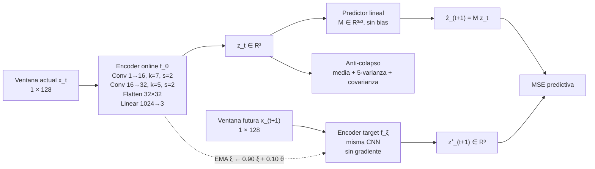
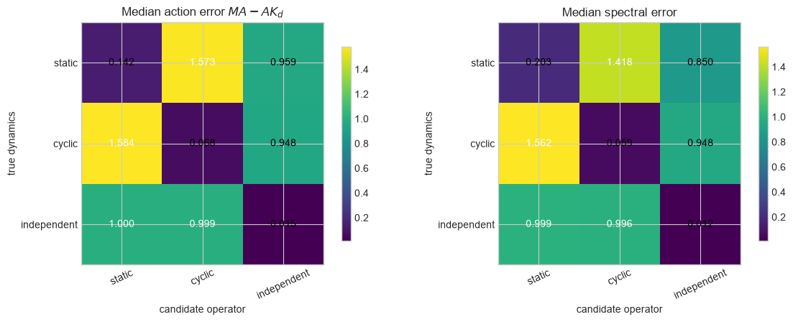
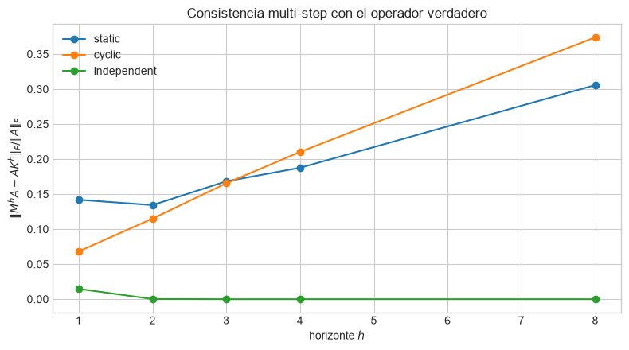

# Koopman-JEPA

Experimento controlado para preguntar si un JEPA temporal puede aprender una
dinámica lineal no trivial en su espacio latente, sin reconstruir la señal y
sin recibir una loss espectral.

> **Respuesta corta:** sí, en este sistema sintético de cuatro fases. Con las
> mismas observaciones marginales, el predictor aprendido distingue dinámica
> estática, cíclica e independiente en `10/10` seeds por condición.

La [versión compilada en PDF](output/pdf/koopman_jepa_overview.pdf) presenta
esta misma historia con ecuaciones, arquitectura y figuras en LaTeX.

## 1. Pregunta científica

Buscamos una representación

$$
z_t=f_\theta(x_t)
$$

y un predictor lineal $M$ tales que

$$
Mz_t\approx z_{t+1}.
$$

Sabemos cuál es la dinámica verdadera sobre las variables ocultas de fase. Si
$\psi(r)$ representa esas fases, $K$ es su operador y el encoder aprende
$z\approx A\psi$, entonces la relación que debe cumplir el predictor es

$$
\boxed{MA\approx AK}.
$$

No buscamos que las matrices $M$ y $K$ sean iguales: el encoder puede elegir
otra base latente. La ecuación de entrelazamiento comprueba que ambas matrices
describen la misma dinámica en coordenadas diferentes.

## 2. Dataset controlado

La variable oculta tiene cuatro fases, $r\in\{0,1,2,3\}$. Cada fase genera una
ventana de longitud 128 con un pulso principal y uno secundario. A cada ventana
se le aplican nuisance factors independientes:

$$
x_t[\tau]
=a_t\,s_{r_t}(\tau-\delta_t)+b_t+\epsilon_{t,\tau},
$$

donde la amplitud $a_t$, el desplazamiento $\delta_t$, el offset $b_t$ y el
ruido $\epsilon$ cambian entre ejemplos. Por eso la red no puede memorizar una
única señal por fase.

Dentro de cada seed se generan una sola vez los bancos de ventanas actuales y
futuras. Las tres condiciones reutilizan exactamente esos bancos; sólo cambia
cómo se forman los pares temporales:

| Condición | Pairing de fases | Acción esperada | Espectro activo |
|---|---|---|---|
| Estática | $r_{t+1}=r_t$ | conservar cada fase | $\{1,1,1\}$ |
| Cíclica | $r_{t+1}=r_t+1\pmod 4$ | rotar las fases | $\{-1,i,-i\}$ |
| Independiente | todos los pares balanceados | media condicional cero | $\{0,0,0\}$ |

Cada condición y seed contiene:

- `1024` pares de train y `256` pares de validation;
- ventanas de forma `1×128`;
- marginales uniformes de fase actual y futura;
- exactamente la misma arquitectura, inicialización y presupuesto de training.

Este control es crucial: si $M$ cambia entre condiciones, el cambio sólo puede
provenir del pairing temporal, no de diferencias visuales en el dataset.

## 3. Arquitectura



Detalles de optimización:

- CNN online: AdamW con learning rate `1e-3`;
- predictor $M$: learning rate `4e-3`;
- target encoder: media móvil exponencial con momentum `0.90`;
- encoder online congelado después de la época 3;
- predictor entrenado durante 60 épocas;
- dimensión latente `3`, igual a la dimensión del subespacio centrado de cuatro
  fases.

Congelar el encoder no forma parte de la teoría de Koopman: fue una decisión de
optimización para evitar que la escala del latent siguiera cambiando mientras
$M$ intentaba alcanzarlo. Por eso se reporta como una limitación.

## 4. Cómo evaluamos el operador

Para cada modelo estimamos $A$ a partir de los centroides latentes de fase y
comparamos el predictor con los tres candidatos:

$$
E_d(M,A)=
\frac{\lVert MA-AK_d\rVert_F}{\lVert A\rVert_F},
\qquad
d\in\{\text{estática, cíclica, independiente}\}.
$$

La dinámica predicha es la que obtiene menor $E_d$. Repetimos la comparación
con los eigenvalues de $M$ restringido al span activo. Una seed sólo cuenta si
ese span tiene rango 3.

La regla fue fijada antes de ejecutar las condiciones nuevas: al menos `8/10`
seeds correctas por condición. Con tres candidatos elegidos al azar,
$P(X\geq8\mid n=10,p=1/3)\approx0.0034$. La loss total se registra para
diagnóstico, pero no decide si se aprendió Koopman.

## 5. Resultado principal

| Dinámica verdadera | Acción correcta | Espectro correcto | Error de acción mediano | Margen al segundo candidato |
|---|---:|---:|---:|---:|
| Estática | 10/10 | 10/10 | 0.142 | 0.806 |
| Cíclica | 10/10 | 10/10 | 0.068 | 0.877 |
| Independiente | 10/10 | 10/10 | 0.015 | 0.981 |

Las 30 corridas conservaron rango activo 3 y lograron probe lineal de fase del
100%.

### Cómo leer el mapa de calor



- Las filas indican la dinámica usada para entrenar.
- Las columnas son los tres operadores candidatos usados para explicar $M$.
- Un valor bajo y oscuro significa mayor compatibilidad.
- La diagonal es el operador correcto. Es el mínimo en las seis comparaciones:
  tanto por acción $MA-AK_d$ como por espectro.
- Los valores fuera de la diagonal quedan aproximadamente entre `0.85` y
  `1.58`, lejos de los errores correctos `0.015–0.203`. No es una victoria por
  diferencias diminutas o por redondeo.

La figura es la evidencia más directa de que $M$ responde a la dinámica. Si el
modelo sólo reconociera la apariencia de las cuatro fases, las tres filas
deberían producir predictores similares porque sus marginales son idénticas.

### Qué dicen los rollouts



El segundo gráfico evalúa

$$
\frac{\lVert M^hA-AK^h\rVert_F}{\lVert A\rVert_F}
$$

para horizontes $h\in\{1,2,3,4,8\}$.

- Independiente cae prácticamente a error cero desde $h=2$: un predictor
  contractivo converge rápido a la acción nula esperada.
- Estática comienza cerca de `0.142` y llega aproximadamente a `0.305` en
  $h=8$.
- Cíclica comienza cerca de `0.068` pero llega aproximadamente a `0.377` en
  $h=8$.

Por lo tanto, el operador correcto está claramente identificado a un paso, pero
los pequeños errores se acumulan. La consistencia a largo horizonte es la
principal limitación cuantitativa visible en este experimento.

## 6. Conclusión

En este toy controlado, el JEPA aprende una representación de fase de rango 3 y
un predictor lineal cuya acción y espectro cambian con la transición temporal.
Esto constituye evidencia positiva de aprendizaje de una restricción Koopman
no trivial, no del operador Koopman completo.

Todavía no demuestra generalidad:

- sólo estudiamos cuatro estados y un latent de dimensión conocida;
- el control conjunto usa validation, no una nueva partición ciega;
- el encoder se congela temprano;
- los rollouts estático y cíclico acumulan error;
- faltan ruido fuera de distribución, observación parcial y eigenvalues con
  módulo menor que uno.

El próximo paso confirmatorio es congelar este control completo y repetirlo con
nuevas realizaciones ciegas. Después corresponde estudiar cómo estabilizar
$M^h$ sin introducir los eigenvalues verdaderos en la loss.

## 7. Dónde mirar

- [Notebook principal ejecutado](notebooks/stage3_three_dynamics_control.ipynb):
  outputs, figuras y análisis por seed.
- [Recorrido científico corto](notebooks/README.md): cinco notebooks esenciales.
- [Protocolo predeclarado](docs/STAGE3_THREE_DYNAMICS_PROTOCOL.md): decisión y
  null fijados antes de entrenar las condiciones nuevas.
- [Research brief](RESEARCH_BRIEF.md): matemática, hipótesis y alcance completo.
- [Bitácora técnica](notebooks/EXPERIMENT_LOG.md): debugging y gates históricos.
- [Configuraciones](configs/README.md): protocolo principal frente a archivos
  de soporte e historial.

## Reproducir

```bash
uv sync --extra dev
uv run jupyter nbconvert \
  --to notebook --execute --inplace \
  notebooks/stage3_three_dynamics_control.ipynb \
  --ExecutePreprocessor.timeout=1800
```

```bash
uv run pytest -q
uv run ruff check .
```

Compilar la versión LaTeX:

```bash
mkdir -p output/pdf
tectonic docs/koopman_jepa_overview.tex --outdir output/pdf
```
