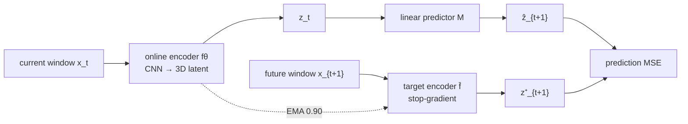
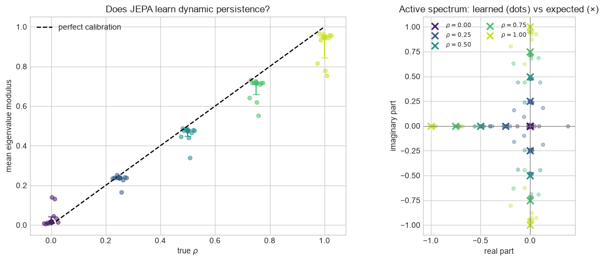

# Koopman-JEPA

## Prior work and credit

This exploratory project is directly motivated by [Ruiz-Morales et al. (AAAI
2026), *Koopman Invariants as Drivers of Emergent Time-Series Clustering in
Joint-Embedding Predictive Architectures*](https://doi.org/10.1609/aaai.v40i30.39708).
They connect time-series JEPA representations to Koopman-invariant regime
indicators with eigenvalue $\lambda=1$. In that interpretable solution, the
latent linear predictor acts as the identity; constraining it near identity is
the key inductive bias that selects this solution from equivalent optima.

This repository does not originate that JEPA-Koopman connection. It takes their
result as its starting point and asks a narrower exploratory question: can the
same predictive architecture represent non-trivial cyclic and contractive
spectral dynamics?

## Research question

When the observation distribution stays fixed but the temporal transition
changes, does a temporal JEPA learn a latent representation

$$
z_t = f_\theta(x_t)
$$

and a linear predictor $M$ whose action reflects the underlying dynamics?

The concrete test is

$$
M z_t \approx z_{t+1},
\quad
M A \approx A K,
$$

where $K$ is the known operator on the hidden phase, and $A$ maps phase
coordinates into the learned latent basis.

> **Exploratory finding in this controlled toy system:** the learned predictor
> distinguishes static, cyclic, and independent transitions in 10/10 seeds per
> condition. Its active spectrum also changes continuously with dynamic
> persistence, with spectral-modulus MAE 0.027 and $R^2=0.9998$. This describes
> the behavior of the complete setup; it does not yet isolate which modeling or
> optimization choices make that behavior possible.

[Short PDF report](output/pdf/koopman_jepa_overview.pdf)

## Controlled observations

The hidden state is a phase $r \in \{0,1,2,3\}$. Each phase emits a length-128
window:

$$
x_t[\tau] = a_t\,s_{r_t}(\tau-\delta_t) + b_t + \epsilon_{t,\tau}.
$$

Amplitude, offset, temporal jitter, and noise vary independently across
examples. The current and future observation banks are exactly the same in all
conditions; only their temporal pairing changes. A single window therefore
reveals the phase, but not the transition law.

| Dynamics | Phase transition | Active spectrum |
|---|---|---|
| Static | $r_{t+1}=r_t$ | $\{1,1,1\}$ |
| Cyclic | $r_{t+1}=r_t+1 \pmod 4$ | $\{-1,i,-i\}$ |
| Independent | uniform future phase | $\{0,0,0\}$ |

Each seed and condition contains 1,024 training pairs and 256 validation pairs.
The main comparison uses 10 paired seeds.

## JEPA architecture



The encoder has two convolutional layers (`1→16→32`), flattening, and a
projection to three latent dimensions. The predictor is a randomly initialized
`3×3` matrix without bias.

Training runs for 60 epochs with AdamW. The predictor learning rate is four
times the encoder rate, the online encoder is frozen after epoch 3, and the
target encoder follows an EMA update. Mean, variance, and covariance penalties
prevent representational collapse.

These choices define the scope of the result. In particular, the latent
dimension matches the true dynamic rank, and the early encoder freeze
stabilizes predictor optimization.

## How JEPA behavior is measured

For each phase, its latent centroid forms one column of $A$. The action error
against a candidate operator $K_d$ is

$$
E_d =
\frac{\left\|MA-AK_d\right\|_F}{\left\|A\right\|_F}.
$$

We also restrict $M$ to the active centroid span and compare its eigenvalues
with the expected spectrum. The predeclared identification criterion was at
least 8/10 correct seeds by both action and spectrum. Training loss is not used
to decide operator identification.

## Results

### The predictor follows the transition law

| True dynamics | Action | Spectrum | Median correct error | Margin to next candidate |
|---|---:|---:|---:|---:|
| Static | 10/10 | 10/10 | 0.142 | 0.806 |
| Cyclic | 10/10 | 10/10 | 0.068 | 0.877 |
| Independent | 10/10 | 10/10 | 0.015 | 0.981 |


Each row is one true transition law; each column is a candidate operator. The
low diagonal shows that the learned predictor changes with temporal pairing,
even though every condition has identical single-window marginals. The cyclic
condition recovers the nontrivial active spectrum $\{-1,i,-i\}$.

### One-step identification is stronger than long-horizon prediction


The rollout checks $M^hA \approx AK^h$. Independent dynamics rapidly contract
to zero. Static and cyclic errors grow with the horizon, so accurate one-step
operator identification does not imply perfect long-term prediction.

### The spectrum tracks continuous persistence

We interpolate between the cyclic transition $C$ and a uniform transition
$U$:

$$
P_\rho = \rho C + (1-\rho)U,
\quad
K_\rho = \rho C,
\quad
\sigma(K_\rho) = \rho\{-1,i,-i\}.
$$

| True $\rho$ | Correct action seeds | Median spectral modulus |
|---:|---:|---:|
| 0.00 | 10/10 | 0.016 |
| 0.25 | 10/10 | 0.239 |
| 0.50 | 9/10 | 0.476 |
| 0.75 | 8/10 | 0.718 |
| 1.00 | 7/10 | 0.948 |



The continuous response is close to linear: MAE 0.027, slope 0.937, intercept
0.011, and $R^2=0.9998$. The predictor is slightly contractive at high
persistence. As a result, some seeds confuse neighboring grid values, and the
strict 8/10 criterion does not pass at $\rho=1$. This is reported as behavior,
not relabeled with a post-hoc success threshold.

## What the experiment establishes

Under the documented architecture and training recipe:

- JEPA does not collapse to an invariant representation.
- The linear predictor changes when only the temporal pairing changes.
- Its active action and spectrum recover static, cyclic, and independent laws.
- Its spectral radius tracks a continuous persistence parameter.
- Small one-step errors accumulate under repeated application of $M$.

The experiment does not establish universal Koopman recovery, robustness to a
different observation map, or independence from the chosen latent dimension
and early-freeze recipe. It is a controlled characterization of this JEPA's
learned dynamics.

## Repository map

- [`notebooks/koopman_oracle.ipynb`](notebooks/koopman_oracle.ipynb) verifies
  the operator mathematics using the true phase.
- [`notebooks/observation_audit.ipynb`](notebooks/observation_audit.ipynb)
  verifies that only temporal pairing changes across conditions.
- [`notebooks/three_dynamics_experiment.ipynb`](notebooks/three_dynamics_experiment.ipynb)
  contains the main 30-run JEPA experiment.
- [`notebooks/koopman_decay_generalization.ipynb`](notebooks/koopman_decay_generalization.ipynb)
  contains the 50-run continuous-persistence experiment.
- [`docs/EXPERIMENT.md`](docs/EXPERIMENT.md) records the assumptions,
  evaluation rules, and exact scope in one place.

## Reproduce

```bash
uv sync --extra dev
uv run pytest
uv run jupyter lab
```

The notebooks are committed with their outputs. Exact configurations live in
[`configs/`](configs/), and reusable implementation code lives in
[`src/koopman_jepa/`](src/koopman_jepa/).

## License

Released under the [MIT License](LICENSE).
